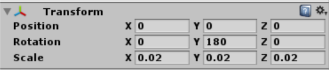
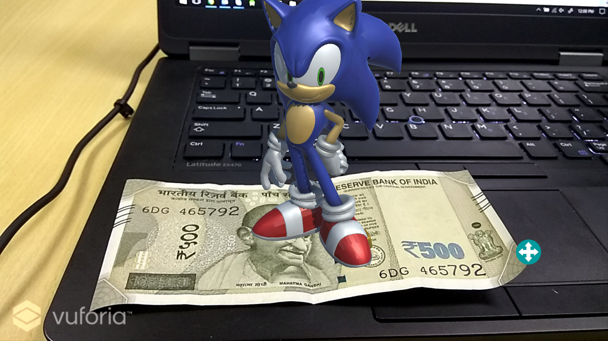
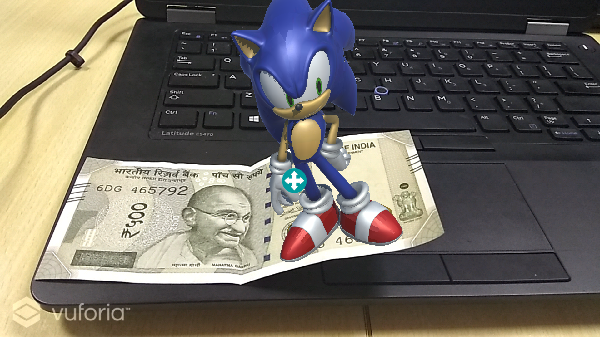

# MyFirstARApp
My First shot at AR.

## Steps to build this app

1. Download Unity (https://unity3d.com/).

2. Login/ Register in https://developer.vuforia.com/

3. Once inside https://developer.vuforia.com/ go to Develop tab and add a License Key.

   a. Project Type: Development
   b. Provide App Name and click Next. Agree terms and conditions.
   c. Click on the app name to get your license key. Copy and keep it safely.

4. Go to "Target Manager" tab and Add a database. Name it anything you want and select Type as Device and Create your database.

5. Download 500Rs.png from the repository.

6. Click on your database and Add Target. Browse for file and select the 500Rs.png image. Width: 5 and give it any Name.

7. Click on Download Database and select Unity Editor.

8. Select the "Downloads" tab and click "Download for Unity". 

9. Download "test.fbx" from the repository.

10. Open Unity and create a new project.

11. Go to File -> Build Settings. In the platforms menu select Android and download android module. Then select it and close the Build Settings.

12. Drag and drop the "vuforia-unity-6-2-10.unitypackage" that you downloaded, into "Assets" folder in the editor and click "Import".

13. Drag and drop the database that you downloaded, into "Assets" folder in the editor and click "Import".

14. Drag and drop the "text.fbx" also into the assets folder.

15. Click on File -> Save Scene As. Save it as main.

16. Inside Assets/Vuforia/Prefabs. Drag and drop ARCamera  and Image Target under main (in the top left of the unity editor) and delete the main camera under the main if it is there.

17. Select the ARCamera and under the Inspector tab click "VuforiaConfiguration".

18. Add License Key that you copied from step 3. Click and Database and Load and Activate your database.

19. Select the image target gameobject from the scene and choose your image target database from the dropdown, and choose the image target you want to track.

20. Drag and drop the test.fbx inside image target gameobject. Now you should be able to see Sonic standing on the note. Adjust the scale in Transforms. My Transform parameters are as follows.

    

21. Now you can try it out. Go ahead and click the "Play" button on top and put a 500 Rupee note in front of your webcam.

22. Download Standard assets (https://www.assetstore.unity3d.com/en/#!/content/21064) and import it into assets.

23. The navigate to Assets/Standard Assets/CrossPlatformInput/Prefabs/ and drag and drop the MobileSingleStickControl under main and delete jump button.

24. Click on mobilejoystick and adjust the size. Restrict Movement range to 50 inside Joystick.

25. Click on test and click Add component under Inspector tab. Add rigidbody and uncheck Use gravity.

26. Add new script called SonicController. Copy the contents of SonicController.cs from the repo to the script.

27. Click on text.fbx from assets and under Inspector tab select Rig and select Animation type to be Legacy.

28. Click on ARCamera under main. Under the Inspector tab click Add component. Add script Focus Camera and copy the contents of focusCamera.cs into the file.

29. You can test it out by clicking the play button and check using the web cam.

30. Click File-> Build Settings and click on Add Open Scenes and add main.

31. Click Build and Run. Choose ADB and choose where to save the apk. Plug in your android device and the app will run on the device.

    ​

## Screenshots

## P.S.

Here you go [Vishal Gauba](//github.com/FlameFractal) ...
